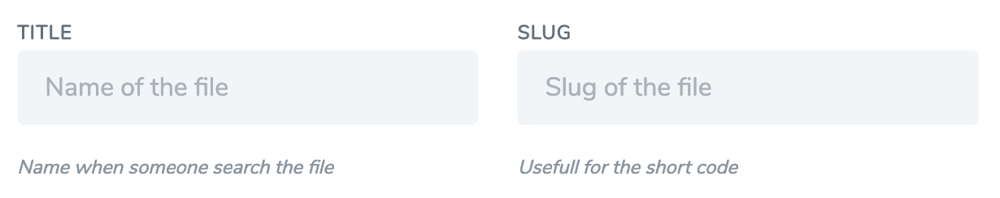
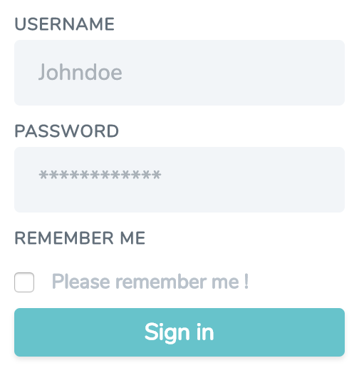

<p align="center">


</p>

<p align="center">
<a href="https://packagist.org/packages/tomjamon/laravel-custom-html"></a>
<a href="https://packagist.org/packages/tomjamon/laravel-custom-html"></a>
<a href="https://packagist.org/packages/tomjamon/laravel-custom-html"></a>
</p>

## Laravel Custom HTML

Based on [HTML and Form Builders](https://github.com/LaravelCollective/html "Github Project LaravelCollective/html") 
from [Laravelcollective](https://laravelcollective.com/ "Laravel Collective's Homepage")

This library offer : 
- 14 publishable components 
- 2 themes ([Tailwind](http://tailwindcss.com/ "Tailwind's Homepage") and [Boostrap](https://getbootstrap.com/ "Boostrap's Homepage")).
- A new component "**control()**" allow you to have an input, his label and his error message within a parent block, in one call.
 
The easiest way to install this library is to simply replace LC/HTML by this tool.

## Installation

Install with composer :
```shell
composer require tomjamon/laravel-custom-html
```

Edit your ``config/app.php`` and add thoses lines :

##### providers
```php
TomJamon\Html\HtmlServiceProvider::class,
```

##### aliases
```php
'Form' => TomJamon\Html\FormFacade::class,
'Html' => TomJamon\Html\HtmlFacade::class,
```    
        
## Custom components

Publish vendor views : ``php artisan vendor:publish``

Choose : ``Provider: TomJamon\Html\HtmlServiceProvider``

A new folder ``resources/views/vendor/customhtml`` will be created with every components.

You can now change every components classes and stuff.

## Components list

- button
- checkbox
- close
- control
- datalist
- form
- input
- label
- link
- optgroup
- option
- select
- submit
- textarea
- file

## Themes

If you want to use a theme you can customize it in config/customhtml.php

FYI : Creating a TailwindCSS theme is the opposite of what Tailwind is made for.
Please custom the theme, the theme is just giving a little help, an example of each component.
 

## Examples

##### Simple text input 

```php
{!! Form::control('text', 'name', $errors, [
    'label' => 'Nom Prenom',
    'placeholder' => 'John Doe',
    'md' => '1/2'
]) !!}
```
___

___
##### Select

```php
{!! Form::control('select', 'type', $errors, [
    'label' => 'Type',
    'message' => 'Choose wisely the type of object',
    'data' => [
        'one' => 'First choice', 
        'two' => 'Second choice', 
        'three' => 'Third choice'
    ]
]) !!}
```

##### Textarea with an overrided rows number (Second array arguments)

```php
{!! Form::control('textarea', 'content', $errors, [
    'label' => 'Content',
    'placeholder' => 'Post content',
], [
    'rows' => '25'
]) !!}
```

##### Input File

With the control call, generating for you a label and parent block

```php
{!! Form::control('file', 'thumbnail', $errors, [
    'label' => 'Your thumbnail',
]) !!}
```

Or you can directly insert the input file :

```php
{!! Form::file('thumbnail')  !!}
```

And don't forget the 'files' => true in the Form::model() or Form::open()

## Why use : Clarity and simplicity

Here is how a form can look like

##### Login form

```php
{!! Form::open(['route' => 'login']) !!}
    {!! Form::control('text', 'email', $errors, [...],  [...]) !!}
    {!! Form::control('password', 'password', $errors, [...]) !!}
    {!! Form::control('checkbox', 'remember', $errors, [...], [...]) !!}
    {!! Form::submit('Sign in') !!}
{!! Form::close() !!}
```
___

___
